🔥

I'm writing this cause I don't have any documentation about my thesis, which was done over 4 years ago. No, my skill hasn't improved when it comes to programming from then. I don't intend to stay that way though, I hope. By writing everything down, I hope that I could look back and see my mistakes and what I did wrong (if there's any, but I'm very confident that there is). 

I had a vague understanding on Machine Learning when I made this. I just thought that I wanted to make something cool. It took me months of journals reading to figure out what to make and tools to make it with. I decided on 'Fire Detection' as the topic and Matlab as the programming tool. Originally, it was supposed to be a live camera detection, but the time restrain and my lack of skill prevented me to do so ¯\_(ツ)_/¯  

The methods that I used were RGB & YCbCr converting, SVM, and K-Means Clustering. Okay look, I'm not gonna sit here and pretend that I knew what I was doing. I didn't know what I was doing, at least not 100% at the time. I had an idea on how those Algorithm works and just went with it. I had to do a lot of trial and error in the result of that. Why did I use those methods? Well I just read a lot of journals, then pretty much mix-match what works and what doesn't.  

This is the summary on how I processed the data:
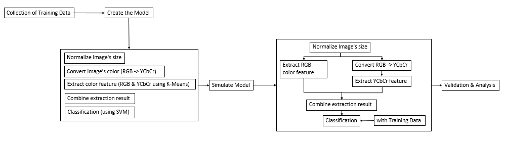
* I know it's not a proper diagram but I'm sure you get the point
 
Every image that's used needed to be normalized and I picked 150x150 px as the desired size. Then the images would be processed so that the colors needed could be extracted.
 
For RGB, the color didn't need to be converted so I just had to extract the Red feature of RGB using K-Means Clustering method. 
 
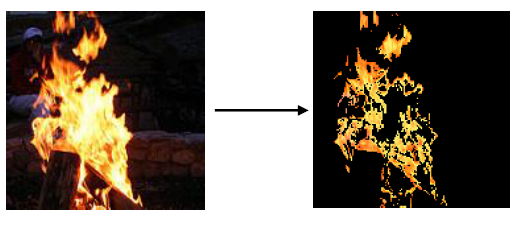
As for YCbCr, I had to convert the image's color profile first before extracting the feature. So gotta convert RGB color profile -> YCbCr, then extract the feature like I did with the RGB one.
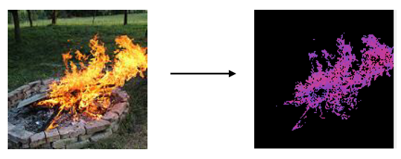
 
My thought on using these color profile is that I could get the red component from RGB, then get the luma component from YCbCr. Fire profile consists of said components (it applied at least to the fires I monitored). The profiles then processed further for classification using SVM. I would like to explain more about the methods but 
 
The following is the UI result of this experimentation. The base of the experiment (the training data) has been inputted on the backend. The classification would refer to the training data as the benchmark of the classification.
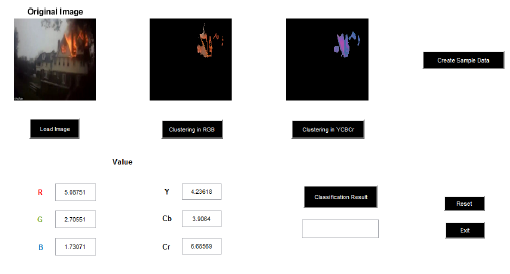
User would need to load the normal image. Then Cluster the RGB profile, then cluster said image for the YCbCr profile. After creating 'Sample Data', the result would show 'Api' (fire) or 'Bukan Api' (not fire). 
 
For comparison, I also used non-fire images for a false parameter. Since this experimentation used Confusion Matrix for validating and analyzing the result. For the experimentation, I did 4 different scenarios, in which I used 20 samples for each. 
- Daylight, Forested area
- Night time, Forested area
- Daylight, Building area
- Night time, Building area
 
Here's some of the sample results:
* Benar = True
  Salah = False
 
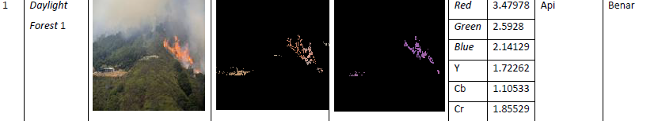  
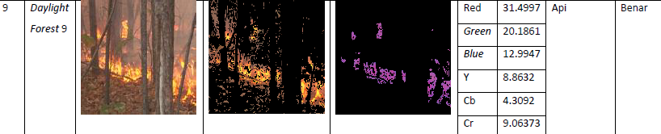  
 
The images are acquired from various source. I did make sure that every images are under Creative Common License, just to make sure. Which is why it took me a while to gather these the sample images. 
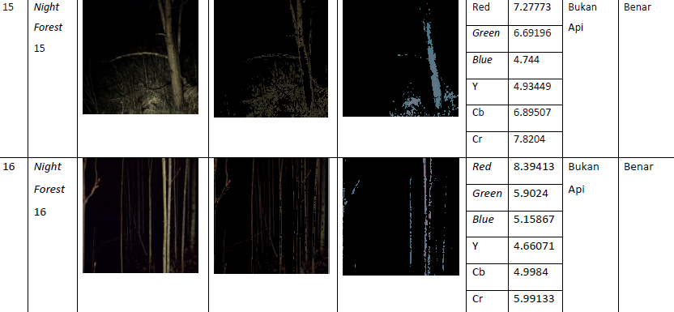  
The results are from 'Daylight, Forested area' and 'Night time, Forested area' scenarios. The results I attached coincidentally has 'True' result, which occurs when the expected result and the actual result is correct. 
 
Here's some more results from different scenarios:
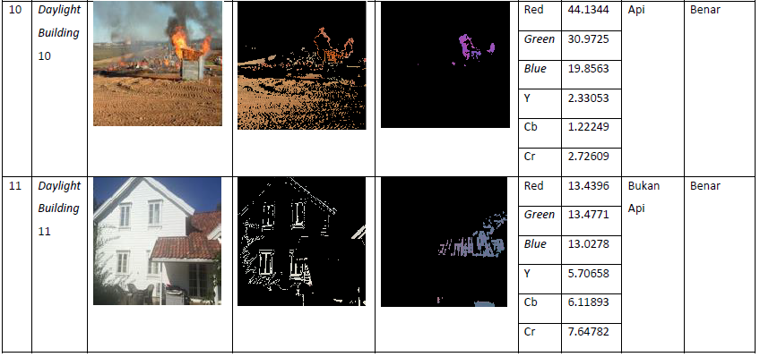 
These results included both True Positive; the Daylight  image was correct to the expectation; and True Negative which was also correct to the expected result. They are from the 'Daylight, Building Area' scenario.
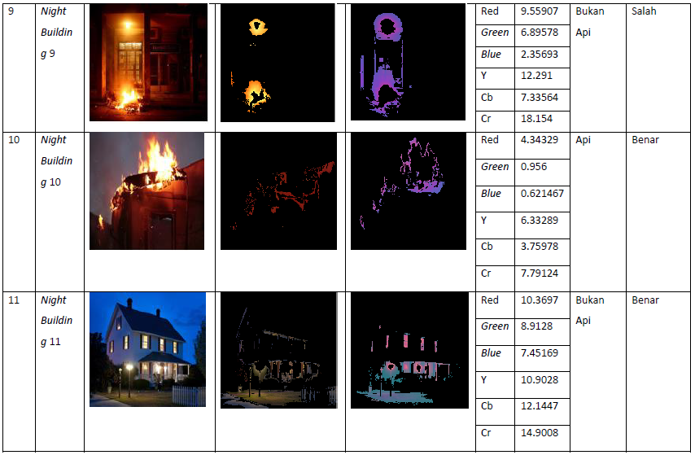 
The results are from 'Night time, Building Area' scenarios. The results I attached have 3 different result. The first one is False Negative, which was the result of an image that has fire. It resulted in 'No Fire' result, which is a Negative result and it was False. Hence the 'False Negative' result. The second one is a True Positive, then followed by a True Negative result. 
 
After processing all the images and its result, I compiled all of it to a table result based on each scenarios.
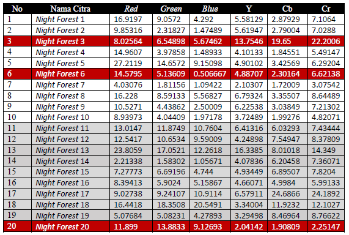 
The false results are highlighted in red and there were 3 in this scenario. The results then calculated using Confusion Matrix calculation.
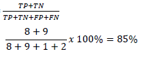 
Based on the calculation, this scenario has an 85% accuracy, which is pretty good in my opinion. It needs to be noted, that the accuracy level on this scenario is the lowest amongst other scenarios. The overall results are:
- Daylight, Forested Area: 95%
- Night Time, Forested Area: 85%
- Daylight, Building Area: 95%
- Night Time, Building Area: 90%
 
In conclusion, I do think that combining both color profile worked well, since both color profile represent fire characteristics in its own way. Combining the two helped classifying fire characteristics better. 
 
This of course could be developed further, using a different method for extraction or classification for example. Or the object itself could be varied on the next experimentation, using an image of different type of fire (the fire level or different fueled fire) for example. Also, this could be improved much more if implemented on different format, like a live recording for example. It would be useful to detect and notify fire presence in real time. It was my initial plan but again, my lack of skill and knowledge back then was very limited.  
 
So there it is, my first ever project. I'm pretty happy on how it turned out and I still think so to this day. 